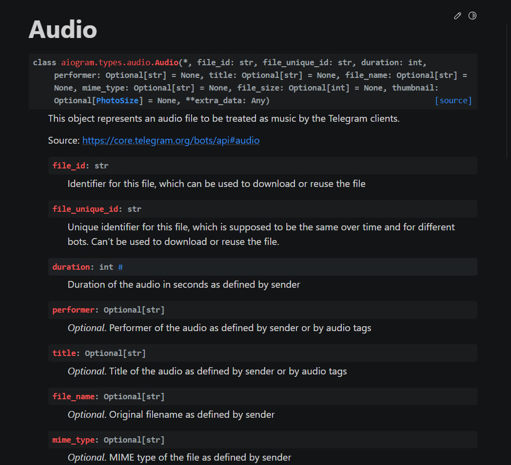

# Guide bot

Бот облегчающий поиск или же - бот гид, создан для упрощения поиска документации aiogram. Благодаря работе в инлайн-режиме он позволяет быстро находить интересующие вас методы и функции без необходимости заходить на сайт aiogram и тратить на поиск много времени.

[](https://choosealicense.com/licenses/mit/)
## Screenshots

 

 



## Deployment

To deploy this project run

```
  git clone https://github.com/DaniilPK/GuideAiogrambot
  
  cd GuideAiogrambot
  
  pip install -r requirements.txt 
```


